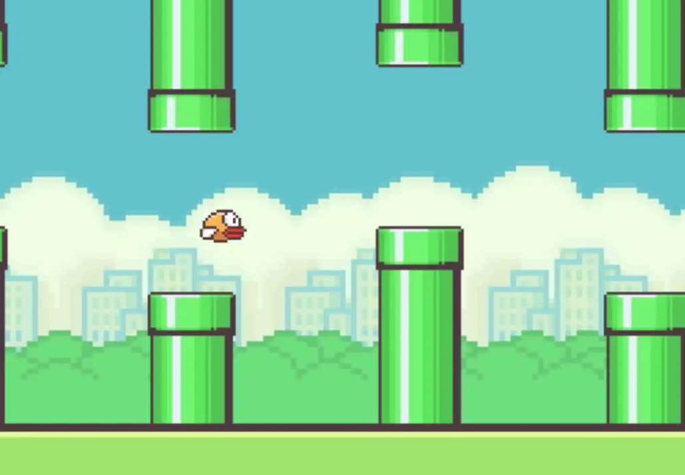
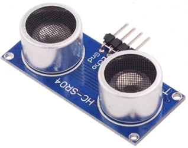
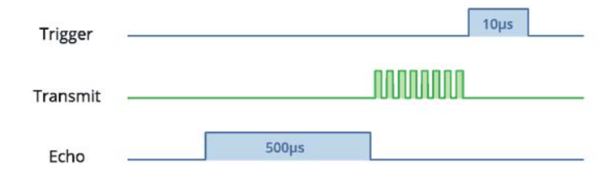
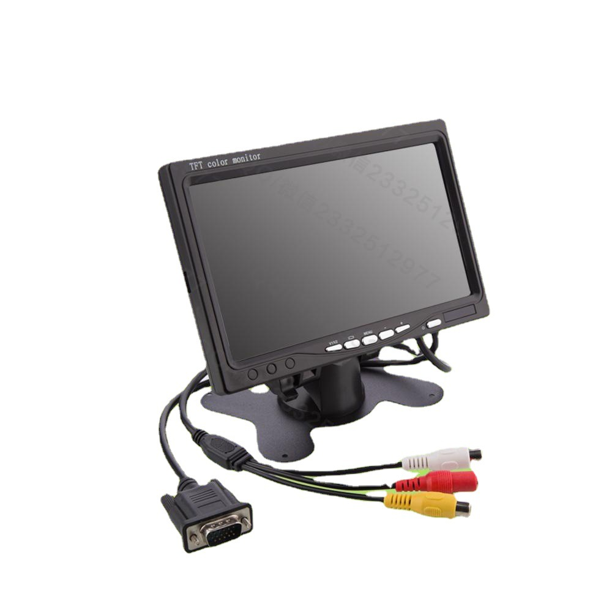
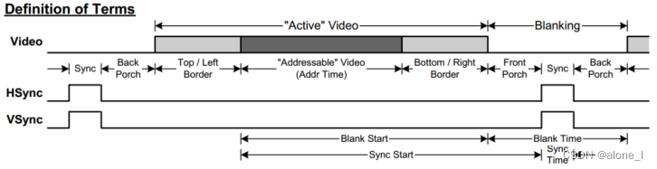
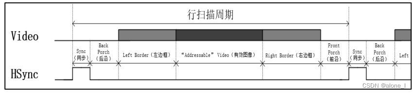
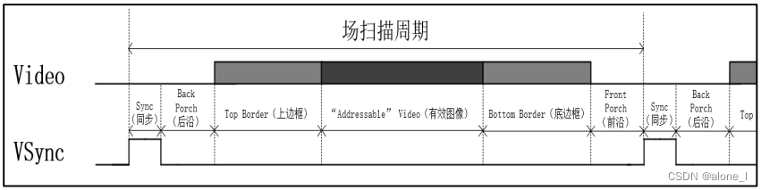
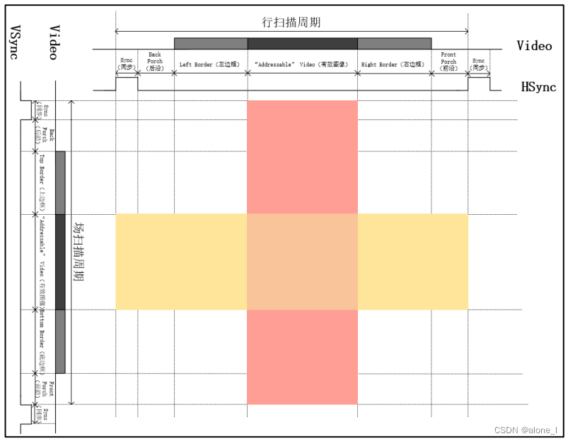

# 基于超声波感应的飞行避障游戏开题报告

    孔煦涵 12012112  王宇 12112725

## 项目背景:

​		Flappy Bird是一款极为简单却又极具挑战性的移动游戏，由越南开发者阮哈东（Dong Nguyen）开发并在2013年发布。游戏以其简单的控制和高难度的游戏性质而迅速走红，成为全球下载量最高的应用之一.Flappy Bird 的玩法非常直接。玩家控制一只小鸟，目标是让这只小鸟飞过由上下排列的水管所组成的障碍。玩家通过在屏幕上轻敲来使小鸟稍微向上飞行，如果停止轻敲，小鸟则会迅速下坠。每次成功通过一个障碍，玩家就会获得一分。游戏的挑战在于控制小鸟的飞行高度和速度，避免触碰到任何水管或地面。游戏的界面非常简单，图形风格类似于早期的8位电子游戏，具有复古的感觉。

    

## **项目目标**：

​		本项目旨在开发一款基于Nexys4 DDR Artix-7 FPGA板的Flappy Bird游戏。项目的核心目标是实现一个交互式游戏，其中游戏的显示将通过VGA协议连接到外部显示屏。为了增加游戏的互动性和创新性，我们将采用HC-SR04超声波模块来检测玩家手部的距离，通过这种非接触式的物理交互方式控制游戏中的小鸟上升和下降。

具体目标如下：

**硬件集成与配置**：整合Nexys4 DDR Artix-7 FPGA板和外部硬件（VGA显示屏和HC-SR04超声波模块），确保所有组件正常协同工作。
	
**VHDL开发**：使用VHDL语言开发FPGA逻辑，包括图形生成、游戏逻辑和接口逻辑，确保游戏运行流畅且具备良好的用户体验。
	
**超声波模块集成**：开发和调试超声波模块与FPGA板的接口，实现准确和响应迅速的手部距离检测系统。
	
**界面与交互设计**：设计易于使用的游戏界面，并通过VGA协议实现图形输出，使游戏画面清晰且反应灵敏。

**测试与优化**：进行系统的综合测试，包括硬件性能测试和用户交互测试，根据测试结果对系统进行优化。

 项目预计达成功能如下:

•1. 在屏幕上生成直升机

•2. 用超声波模块控制直升机的起飞与降落

•3. 创建模拟重力

•4. 生成随机障碍墙壁

•5. 实现暂停功能

•6. 实现直升机与墙壁碰撞的机制判定

•7. 实现分数计算功能

•8. 实现重新开始功能

•9. 实现游戏结束界面

•10. 实现排行榜功能

## 项目涉及外部模块:

### 1.超声波模块

    

该模块主要包含下面几个组件:

- **超声波发射器**：用于发射超声波信号。

- **超声波接收器**：用于接收反射回来的超声波信号。

- **控制电路**：用于处理信号并计算距离。

- **触发器和回声引脚**：触发器引脚用于激活超声波发射，回声引脚用于接收超声波回声的信号。

其工作原理如下:

​	  	**触发超声波发射**：

   - 使用者需要向HC-SR04的触发引脚发送一个至少10微秒的高电平信号（通常使用微控制器如Arduino来控制）。
   - 模块收到这个信号后，自动发射一系列超声波脉冲（通常是8个40kHz的脉冲）。
**超声波传播和反射**：
   - 发射的超声波脉冲以声音的速度向前传播，遇到障碍物后反射回来。
**接收回声**：
   - HC-SR04的接收器部分检测到这些反射的超声波信号，并将信号传递给控制电路。
   - 控制电路随后将接收到的回声转换为电信号，并通过回声引脚输出。
**计算距离**：
   - 回声引脚输出的是一个高电平信号，其持续时间等于超声波从发射到接收的时间。
   - 距离的计算基于超声波的传播时间。使用公式$\text{Distance} = \frac{\text{Speed of Sound} \times \text{Time}}{2}$计算，其中声速在空气中大约为344米/秒（取决于环境条件，如温度和湿度）。
   - 之所以除以2，是因为这个时间包含了超声波发射到障碍物再反射回传感器的整个往返过程。

    

### 2.VGA显示模块

    

VGA (Video Graphics Array),视频图形阵列，是一种使用模拟信号进行视频传输的标准协议。VGA接口中以针式引出信号线的称为公头，以孔式引出信号线的称为母头。VGA接口中，三基色的引脚传输的是模拟信号。

**VGA显示原理**：

   - 在行、场同步信号的同步作用下，扫描信号定位到左上角第一个像素点坐标。
   - 自左上角第一行第一个像素点坐标，逐个像素点向右扫描。
   - 自左上角第一行第一个像素点坐标，逐个像素点向右扫描。
   - 重复若干次扫描至最后一行行尾，一帧图像扫面完成，进行图像消隐，扫描坐标跳转回左上角第一行行首，开始下一帧图像扫描。
   - 在扫描过程中回对每一个像素点单独赋值，使每个像素点显示对应色彩信息。

**VGA时序标准**：

VGA时序标准图如下：

    

VGA时序分为行同步时序和场同步时序，其中行同步时序图像如下：

    

* 一个完整的行扫描周期包含6个部分：sync（同步）、back porch（后沿）、left border（左边框）、addressable video（有效图像）、right border（右边框）、front（前沿）。在一个图像扫描周期中，图像在行同步信号下同步完成一行图像的扫描显示，图像信息只在“有效图像”阶段有效。行同步信号仅在同步阶段拉高，其余时间均为低。

场同步时序图像如下：

    

* 一个完整的场扫描周期包含6个部分：sync（同步）、back porch（后沿）、top border（上边框）、video（有效图像）、bottom border（底边框）、front porch（前沿）。

只有当行扫描周期与场扫描周期同时有效时，VGA的图像才会显示，其时序图如下，两者相交的部分为图像的最终显示区域：

    

**设计模块**：

该设计主要包括三个模块：**VGA时钟产生模块**、**VGA时序控制模块**、**图像数据生成模块**。

* **时钟产生模块：**时钟产生模块是利用IP核产生VGA工作所需要的时钟，其中RST复位信号是高电平有效，所以在应用时需将其取反。时钟锁定信号locked是用来指示输出时钟的状态，在时钟震荡过程中locked保持低电平；在时钟稳定后，locked信号赋值高电平，表示输出时钟稳定且可被其他模块使用。
* **时序控制模块：**VGA时序控制模块接收来自图像数据生成模块生成的彩条图像色彩信息，在模块内部使用使能信号滤除掉非图像显示有效区域的图像数据，产生RGB色彩信息，在行、场同步信号的同步作用下，将RGB色彩信息扫描显示到VGA显示器，显示出彩条图像。
* **图像数据生成模块：**该模块以VGA时序控制模块传入的像素点坐标（pix_x,pix_y）为约束条件，生成待显示彩条图像的色彩信息。

## **实施计划与时间表**：

week10:准备与购买上述涉及的模块

week11:搭建程序框图,理通游戏各部分逻辑

week12-13:学习相关知识,实现基本功能

week14-15:进行项目测试并加以改进

week16:项目展示与报告提交

## 具体分工 ##

孔煦涵：游戏逻辑与超声波模块

王宇：图形界面与VGA显示模块
